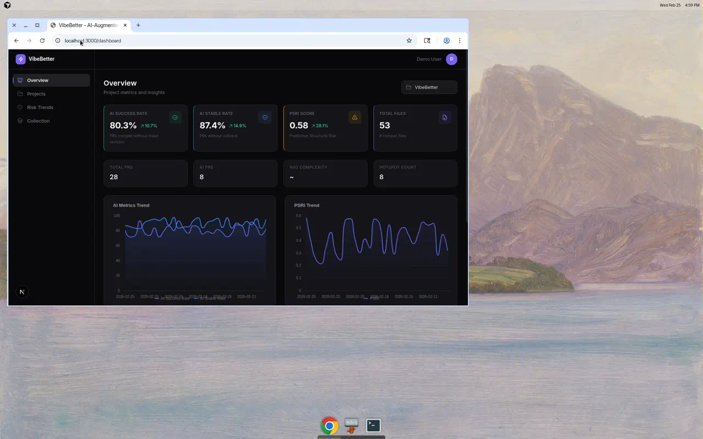
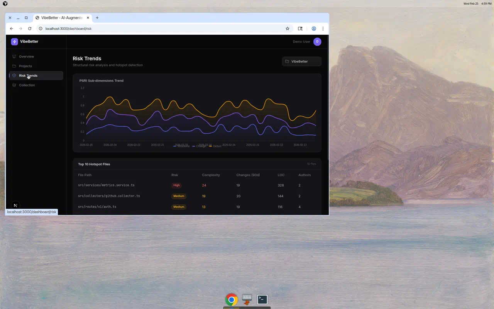
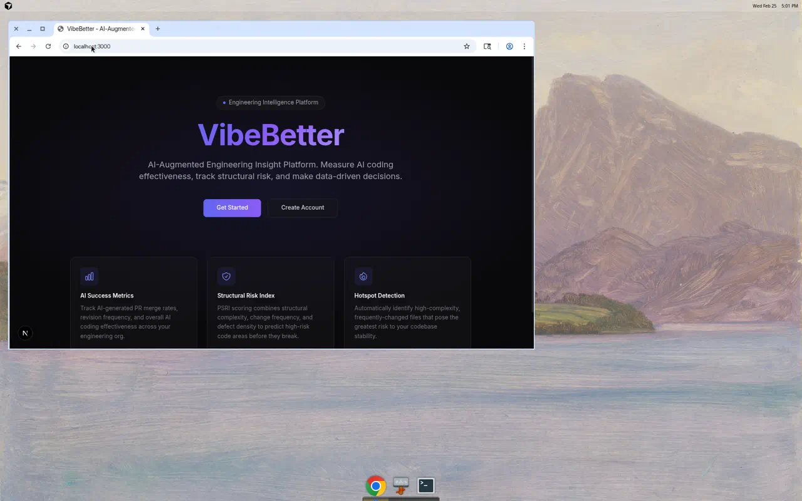

<div align="center">

# VibeBetter

### AI-Augmented Engineering Insight Platform

Measure AI coding effectiveness, track structural risk, and make data-driven engineering decisions.

[](https://www.typescriptlang.org/)
[](https://nextjs.org/)
[](https://hono.dev/)
[](https://www.postgresql.org/)
[](./LICENSE)

</div>

---

## Overview

VibeBetter (AEIP) is an engineering intelligence platform that helps organizations understand the real impact of AI-assisted coding on their codebase quality, structural risk, and team productivity.

As AI coding tools (Copilot, Cursor, etc.) become widespread, engineering leaders need answers to critical questions:

- **Is AI actually improving engineering efficiency?**
- **Is AI introducing structural risk or technical debt?**
- **Which modules are AI-suitable vs. AI-risky?**
- **How do we make data-driven AI adoption decisions?**

VibeBetter provides the data infrastructure and analytics to answer these questions.

## Screenshots

### Dashboard Overview


> Metric cards showing AI Success Rate, Stable Rate, PSRI Score with trend indicators. Real-time charts for AI metrics and structural risk trends.

### Risk Trends & Hotspot Analysis


> PSRI sub-dimensions (Structural, Change, Defect) stacked area chart with Top 10 hotspot files table showing risk levels, complexity, and change frequency.

### Landing Page


---

## Features

### Data Collection
- **GitHub Integration** — Automatically collect PR data, commit history, review metrics, and AI usage labels
- **Local Git Analysis** — Parse local repositories for commit frequency, file change heatmaps, and author statistics
- **Extensible Collector Framework** — Plugin-based `IDataCollector` interface with registry pattern for adding new data sources
- **Scheduled Collection** — BullMQ-powered background jobs with retry, scheduling, and progress tracking

### AI Coding Metrics
- **AI Success Rate** — Percentage of AI-generated PRs merged without major revision
- **AI Stable Rate** — Percentage of AI PRs deployed without rollback
- **AI Behavior Detection** — Automatic identification of AI-assisted code via PR labels and commit message analysis

### Risk Analysis
- **PSRI (Predictive Structural Risk Index)** — Composite risk score combining structural complexity, change frequency, and defect density with configurable weights
- **Hotspot Detection** — Automatic identification of high-risk files (high complexity + high change frequency)
- **Risk Score Ranking** — Files ranked by `complexity × changeFrequency` for prioritized attention

### Dashboard & Visualization
- **Metric Cards** — Key indicators with trend arrows and delta percentages
- **Trend Charts** — ECharts-powered line and stacked area charts for historical analysis
- **Quick Stats** — At-a-glance summary of Total PRs, AI PRs, Average Complexity, Hotspot Count
- **Health Assessment Summary** — Contextual narrative summarizing project health based on current metrics
- **Toast Notifications** — Real-time feedback for user actions and background operations
- **Loading Skeletons** — Polished skeleton placeholders during data loading
- **Dark Theme** — Modern, professional dark-mode-first interface

### Decision Recommendations
- **Rule-based Engine** — AI-driven engineering recommendations generated from project metrics
- **Priority-ranked Decisions** — Actionable items ranked by severity and impact
- **Status Tracking** — Mark decisions as open, accepted, or dismissed

### Weight Configuration
- **Per-project PSRI Weights** — Customize the structural, change, defect, architecture, runtime, and coverage weight dimensions
- **Real-time Updates** — Adjust weights and immediately see their impact on risk scores

### Project Management
- **Multi-project Support** — Manage multiple repositories from a single dashboard
- **Project CRUD** — Create, view, and manage engineering projects
- **Collection Management** — Trigger data collection and metric computation per project

---

## Tech Stack

| Layer          | Technology                                                  |
| -------------- | ----------------------------------------------------------- |
| Frontend       | Next.js 15, React 19, TypeScript, Tailwind CSS, ECharts    |
| Backend        | Node.js, Hono, TypeScript, Prisma, BullMQ, Zod             |
| Database       | PostgreSQL 16                                               |
| Cache / Queue  | Redis 7                                                     |
| Monorepo       | pnpm workspaces, Turborepo                                  |
| Testing        | Vitest                                                      |

---

## Architecture

```
┌─────────────────────────────────────────────────────────┐
│                      Frontend                            │
│   Next.js 15 · Tailwind · ECharts · React Query          │
├─────────────────────────────────────────────────────────┤
│                      Backend API                         │
│   Hono · JWT Auth · Zod Validation · BullMQ Workers      │
├─────────────────────────────────────────────────────────┤
│                    Shared Package                        │
│   TypeScript Types · Zod Schemas · Constants · Utils     │
├─────────────────────────────────────────────────────────┤
│                   Infrastructure                         │
│   PostgreSQL · Redis · Prisma ORM · Docker               │
└─────────────────────────────────────────────────────────┘
```

### Monorepo Structure

```
vibebetter/
├── apps/
│   ├── web/            # Next.js frontend (port 3000)
│   └── server/         # Hono API server (port 3001)
├── packages/
│   ├── shared/         # Shared types, schemas, utils
│   └── db/             # Prisma schema & client
├── docs/               # Documentation
│   ├── spec.md         # Product specification
│   ├── research.md     # Technical research
│   ├── plan.md         # Implementation plan
│   └── analysis.md     # Expert review
└── docker-compose.yml  # PostgreSQL + Redis
```

---

## Getting Started

### Prerequisites

- **Node.js** 22+
- **pnpm** 10+
- **Docker** (for PostgreSQL and Redis)

### Installation

```bash
# Clone the repository
git clone https://github.com/xiatiandeairen/VibeBetter.git
cd VibeBetter

# Install dependencies
pnpm install

# Start databases
docker compose up -d

# Configure environment
cp .env.example .env
cp .env apps/server/.env
cp .env apps/web/.env.local

# Initialize database
cd packages/db
npx prisma generate
npx prisma db push
npx tsx seed/index.ts    # Optional: load demo data
cd ../..

# Start development
pnpm dev
```

The application will be available at:
- **Frontend**: http://localhost:3000
- **Backend API**: http://localhost:3001
- **Health Check**: http://localhost:3001/health

### Demo Account

If you ran the seed script:
- **Email**: `demo@vibebetter.dev`
- **Password**: `password123`

---

## Development

### Commands

| Command                                    | Description                    |
| ------------------------------------------ | ------------------------------ |
| `pnpm dev`                                 | Start all services (Turborepo) |
| `pnpm build`                               | Build all packages             |
| `pnpm lint`                                | Lint all packages              |
| `pnpm test`                                | Run all tests                  |
| `pnpm format`                              | Format with Prettier           |
| `pnpm --filter @vibebetter/server dev`     | Backend only                   |
| `pnpm --filter @vibebetter/web dev`        | Frontend only                  |
| `pnpm --filter @vibebetter/server test`    | Backend tests                  |

### API Endpoints

| Method | Endpoint                                          | Description              |
| ------ | ------------------------------------------------- | ------------------------ |
| POST   | `/api/v1/auth/register`                           | Register new user        |
| POST   | `/api/v1/auth/login`                              | Login, returns JWT       |
| GET    | `/api/v1/auth/me`                                 | Current user info        |
| GET    | `/api/v1/projects`                                | List projects            |
| POST   | `/api/v1/projects`                                | Create project           |
| GET    | `/api/v1/metrics/projects/:id/overview`           | Metrics overview         |
| GET    | `/api/v1/metrics/projects/:id/snapshots`          | Historical snapshots     |
| GET    | `/api/v1/metrics/projects/:id/files/top`          | Top risk files           |
| POST   | `/api/v1/metrics/projects/:id/compute`            | Trigger computation      |
| POST   | `/api/v1/collectors/projects/:id/collect`         | Trigger data collection  |
| GET    | `/api/v1/collectors/projects/:id/jobs`            | Collection job history   |
| GET    | `/api/v1/decisions/projects/:id/decisions`        | List decisions           |
| POST   | `/api/v1/decisions/projects/:id/decisions/generate` | Generate decisions     |
| PATCH  | `/api/v1/decisions/decisions/:id/status`          | Update decision status   |
| GET    | `/api/v1/weights/projects/:id/weights`            | Get PSRI weights         |
| PUT    | `/api/v1/weights/projects/:id/weights`            | Update PSRI weights      |
| GET    | `/api/v1/behaviors/projects/:id/ai-behaviors/stats` | AI behavior stats      |
| GET    | `/api/v1/behaviors/projects/:id/user-behaviors/stats` | User behavior stats  |
| GET    | `/api/v1/metrics/projects/:id/recent-prs`        | Recent pull requests     |

---

## Documentation

| Document                                         | Description                              |
| ------------------------------------------------ | ---------------------------------------- |
| [`docs/README.md`](docs/README.md)               | Documentation index                      |
| [`docs/product/spec.md`](docs/product/spec.md)   | Product specification                    |
| [`docs/product/research.md`](docs/product/research.md) | Technology research               |
| [`docs/releases/`](docs/releases/)               | Version archives (changes/tasks/insights)|
| [`docs/roadmap/current.md`](docs/roadmap/current.md) | Current version roadmap             |
| [`docs/process/`](docs/process/)                 | Development process & scoring            |

---

## Roadmap

### Frontend Routes

| Route                    | Description                              |
| ------------------------ | ---------------------------------------- |
| `/`                      | Landing page                             |
| `/login`                 | Authentication                           |
| `/register`              | User registration                        |
| `/dashboard`             | Overview with metric cards and charts    |
| `/dashboard/projects`    | Project management                       |
| `/dashboard/risk`        | Risk trends and hotspot analysis         |
| `/dashboard/decisions`   | Decision recommendations                 |
| `/dashboard/insights`    | AI tool effectiveness and behavior stats |
| `/dashboard/collection`  | Data collection management               |
| `/dashboard/settings`    | Weight configuration and settings        |

---

## Roadmap

- [x] **v0.1.0** — MVP: Data collection + AI metrics + PSRI + Dashboard
- [x] **v0.2.0** — Decisions + AI Insights + Health Assessment + Service layer
- [x] **v0.3.0** — Settings + Radar chart + Toast + Skeleton + Performance
- [x] **v0.4.0** — Webhook + OAuth + Drill-down + Compare + Security + 45 tests
- [x] **v0.5.0** — AI Attribution + Organization + Benchmarks + CI + Docs restructure
- [x] **v0.6.0** — Onboarding + OpenAPI + API Key + Redis Cache + Insight Templates + VS Code
- [x] **v0.7.0** — Quality Engineering: 133 tests, requireProject middleware, Quality Dashboard
- [x] **v0.8.0** — CLI: `vibe` tool with 8 commands for AI Coding workflow
- [x] **v0.9.0** — Local Analysis Mode: `vibe analyze` (offline, no backend required)
- [x] **v0.10.0** — Team Comparison View for enterprise ROI analysis
- [x] **v0.11.0** — Automated Weekly Digest service + `vibe digest` CLI command
- [x] **v0.12.0** — Error Recovery & Resilience (retry logic, ErrorBoundary)
- [x] **v0.13.0** — Actionable Fix Suggestions: `vibe fix` command
- [x] **v0.14.0** — Admin Usage Analytics endpoint (`GET /api/v1/admin/stats`)
- [x] **v0.15.0** — Customizable Decision Rule types (DecisionRule interface + DEFAULT_RULES)
- [x] **v0.16.0** — Enhanced health check endpoint (database + Redis dependency checks)
- [x] **v0.17.0** — Contextual tips in CLI commands (check, insights, status)
- [x] **v0.18.0** — Configurable branding constants (white-label via env vars)
- [x] **v0.19.0** — Metric alert configuration API (AlertConfig model + CRUD endpoints)
- [x] **v0.20.0** — Structured request logging middleware (pino JSON, replaces hono/logger)
- [x] **v0.21.0** — PR risk summary: `vibe pr --markdown` for branch risk analysis
- [x] **v0.22.0** — Transparent rate limit headers (X-RateLimit-Limit/Remaining/Reset)
- [x] **v0.23.0** — Snapshot diff comparison: `vibe diff` for metric trend tracking
- [x] **v0.24.0** — Graceful shutdown: SIGTERM/SIGINT handling with BullMQ cleanup
- [x] **v0.25.0** — Auto-detect project from git remote: `vibe init --auto`
- [x] **v0.26.0** — HTML report export: `vibe report --format html` (self-contained dark theme)

See [`docs/roadmap/current.md`](docs/roadmap/current.md) for next version details and [`docs/releases/CHANGELOG.md`](docs/releases/CHANGELOG.md) for release history.

---

## Contributing

1. Fork the repository
2. Create your feature branch (`git checkout -b feat/amazing-feature`)
3. Commit your changes (`git commit -m 'feat: add amazing feature'`)
4. Push to the branch (`git push origin feat/amazing-feature`)
5. Open a Pull Request

Please follow the [commit conventions](docs/plan.md#4-commit-与-pr-策略) and [code quality standards](docs/plan.md#5-代码质量标准) outlined in the plan.

---

## License

This project is licensed under the MIT License. See the [LICENSE](LICENSE) file for details.
